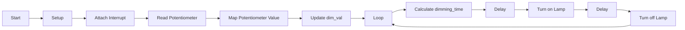

# AC Lamp Brightness Control using Interrupt and PWM

This program controls the brightness of an AC lamp using interrupt and pulse width modulation (PWM) techniques. A potentiometer is used to adjust the lamp brightness.

## Code Description

The code is written in C/C++ and can be uploaded to an Arduino or similar microcontroller. It consists of three major functions: `setup()`, `zero_cross()`, and `loop()`.

### Function Descriptions

1. `setup()`: This function is executed once when the program starts. It performs the following tasks:
   - Sets the lamp pin (`LAMP`) as an output.
   - Attaches an interrupt to digital pin 2 using `attachInterrupt()`.

2. `zero_cross()`: This function is called whenever there is a change on digital pin 2. It performs the following tasks:
   - Calculates the dimming time for the lamp based on the current `dim_val` value.
   - Delays for the calculated dimming time using `delayMicroseconds()`.
   - Turns on the lamp for a brief period using `digitalWrite(LAMP, HIGH)` and `delayMicroseconds()`.
   - Turns off the lamp using `digitalWrite(LAMP, LOW)`.

3. `loop()`: This function runs continuously after the `setup()` function. It performs the following tasks:
   - Reads the value from a potentiometer using `analogRead(A0)`.
   - Maps the potentiometer value to a range between 10 and 49 using `map()`.
   - Updates the `dim_val` variable with the mapped value.

### Hardware Requirements

- AC lamp
- Microcontroller board (e.g., Arduino)
- Potentiometer
- Connecting wires

## Flowchart

The flowchart below illustrates the flow of control and the sequence of actions performed in the code.

The flowchart demonstrates how the program initializes, reads the potentiometer value, calculates the dimming time, and controls the lamp's brightness using interrupt and PWM techniques.

## Usage

To use this code, follow these steps:

1. Connect the AC lamp to the microcontroller's output pin (`LAMP`).
2. Connect a potentiometer to the microcontroller's analog input pin (`A0`).
3. Upload the code to the microcontroller.
4. Observe the changes in the lamp's brightness as you adjust the potentiometer.

## Contributing

Contributions to this project are welcome. You can fork the repository, make improvements, and submit a pull request.

## License

This code is released under the [MIT License](LICENSE).

Feel free to use, modify, and distribute this code for personal and commercial purposes.

## Acknowledgements

Special thanks to the Arduino community for their support and resources.

If you find this code helpful, please give it a star!

## Support

You can support me by buy me a coffee if u like to.

<!--   <h4>And you can also support me by <a href="https://www.buymeacoffee.com/azzar" target="_blank">buying me coffee</a></h4> -->
  

