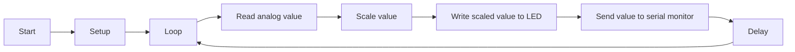

# Analog Potentiometer to LED Control (V1)

This code is an Arduino sketch that reads values from an analog potentiometer and uses the values to control the brightness of an LED. It demonstrates a basic analog input and analog output functionality.

## Prerequisites

To run this code, you'll need:

- An Arduino board (e.g., Arduino Uno)
- An analog potentiometer connected to analog pin A0 of the Arduino board
- An LED connected to digital pin 11 of the Arduino board

## Installation

1. Connect the analog potentiometer to the A0 pin of the Arduino board.
2. Connect the LED to digital pin 11 of the Arduino board.
3. Upload the code to the Arduino board using the Arduino IDE or any other compatible software.
4. Open the serial monitor at a baud rate of 9600 to view the output.

## Flowchart

## Usage

When the code is running on the Arduino board, it continuously reads the analog value from the potentiometer using the `analogRead()` function. It then scales the read value to a range of 0-255 using a simple linear mapping. The scaled value is written to the LED using the `analogWrite()` function, which controls the brightness of the LED.

The code also sends the scaled value to the serial monitor using the `Serial.write()` function, allowing you to monitor the output values.

Adjust the potentiometer knob to change the input value and observe how the LED brightness changes accordingly. The serial monitor will display the scaled output value.

## License

This code is released under the [MIT License](https://opensource.org/licenses/MIT). Feel free to modify and use it according to your needs.

## Troubleshooting

If you encounter any issues or have questions, please consult the official Arduino documentation or the community forums for assistance.

## Acknowledgements

This code is a basic implementation and was created for learning purposes. It may serve as a starting point for more complex projects involving analog input and output control.

## Contributing

Contributions to enhance or extend the functionality of this code are welcome. If you find a bug or have an improvement suggestion, please open an issue or submit a pull request on the GitHub repository.

## Author

This code was written by [Your Name].
