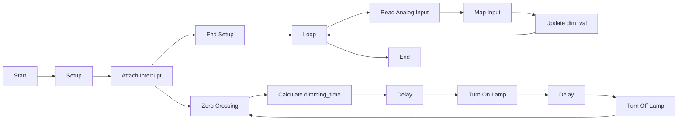

# V2

This README provides an overview of the code and its functionality.

## Introduction
This code is designed to control the brightness of a lamp using a dimming technique called zero-crossing detection. The code utilizes an Arduino board and a potentiometer to read analog input and adjust the lamp's brightness accordingly.

## Prerequisites
To run this code, you will need the following:
- An Arduino board (e.g., Arduino Uno)
- A lamp connected to the board's digital pin 11
- A potentiometer connected to the board's analog pin A0
- A switch or sensor connected to the board's digital pin 2 for zero-crossing detection

## Code Overview
The code consists of three main functions: `setup()`, `zero_cross()`, and `loop()`.

### `setup()`
The `setup()` function is executed once when the Arduino board starts. It performs the following tasks:
- Sets the `LAMP` pin (pin 11) as an output using `pinMode()`
- Attaches an interrupt to the `zero_cross()` function on pin 2 using `attachInterrupt()`. This allows the code to detect the zero-crossing of the AC power signal.

### `zero_cross()`
The `zero_cross()` function is an interrupt service routine (ISR) that is triggered whenever a zero-crossing of the AC power signal occurs. It carries out the following steps:
- Calculates the `dimming_time` based on the `dim_val` variable, which represents the desired lamp brightness (0 to 49). The higher the `dim_val`, the brighter the lamp.
- Delays the program for `dimming_time` microseconds, creating a delay before turning on the lamp.
- Sets the `LAMP` pin to `HIGH`, turning on the lamp.
- Delays the program for 10 microseconds before turning off the lamp by setting the `LAMP` pin to `LOW`.

### `loop()`
The `loop()` function runs repeatedly after the `setup()` function. It performs the following tasks:
- Reads the analog value from pin A0, which is connected to the potentiometer.
- Maps the analog value from the range of 0-1023 to the range of 10-49 using `map()`. This scaling operation converts the potentiometer reading into the desired brightness level.
- Updates the `dim_val` variable with the mapped value, adjusting the lamp brightness accordingly.

## Flowchart

## Usage
To use this code, follow these steps:
1. Set up the Arduino board, connecting the lamp, potentiometer, and zero-crossing detection switch or sensor as described in the prerequisites.
2. Upload the code to the Arduino board using the Arduino IDE or compatible software.
3. Power on the Arduino board.
4. Adjust the potentiometer to control the brightness of the lamp. The lamp's brightness will change according to the potentiometer position.

Note: Ensure that the lamp is compatible with the Arduino board's voltage and current limitations.

## Conclusion
This code provides a simple implementation for controlling a lamp's brightness using zero-crossing detection. By adjusting the potentiometer, users can vary the lamp's brightness to their desired level. Feel free to modify the code to suit your specific requirements or expand its functionality.

For further details and information, please refer to the comments within the code itself.
