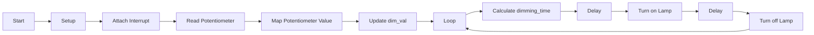

# Lamp Brightness Control with Interrupt and PWM Modulation (V3)

This program controls the brightness of an AC lamp using interrupt and pulse width modulation (PWM) technique. The brightness of the lamp can be adjusted using a potentiometer.

## Description

The code provided implements a system that controls the brightness of an AC lamp based on the input received from a potentiometer. It utilizes interrupts and PWM to achieve smooth and adjustable brightness levels.

The main components of the code are as follows:

1. **LAMP** - This variable represents the digital pin used to control the lamp. In the provided code, it is set to pin 11.

2. **dim_val** - This variable stores the value used to control the brightness of the lamp. The value is updated based on the input received from the potentiometer.

The program consists of three main functions:

1. **setup()** - This function is executed once at the start of the program. It configures the necessary settings and sets up the interrupt. In this case, the lamp pin is set as an output, and an interrupt is attached to digital pin 2.

2. **zero_cross()** - This function is called whenever there is a change on digital pin 2. It calculates the duration for which the lamp should remain on based on the current dim_val value. It then introduces a delay for the calculated time, turns on the lamp for a brief period of 10 microseconds, and turns it off.

3. **loop()** - This function is executed repeatedly after the setup() function. It reads the input value from the potentiometer using analogRead(). The read value is then mapped to a desired range of brightness levels using the map() function. The resulting scaled value is stored in dim_val, which is used by the zero_cross() function to determine the lamp's brightness.

## Flowchart

## Usage

To use this code:

1. Connect the AC lamp to the digital pin specified by the LAMP variable (pin 11 by default).

2. Connect the potentiometer to analog pin A0.

3. Upload the code to an Arduino board.

4. Rotate the potentiometer to adjust the brightness of the lamp. The lamp's brightness will change accordingly.

Note: Ensure proper connections and exercise caution while working with AC voltage.

Feel free to modify the code according to your specific requirements or incorporate it into your projects.
